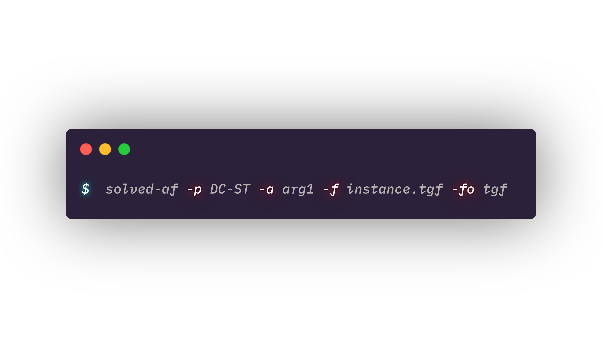
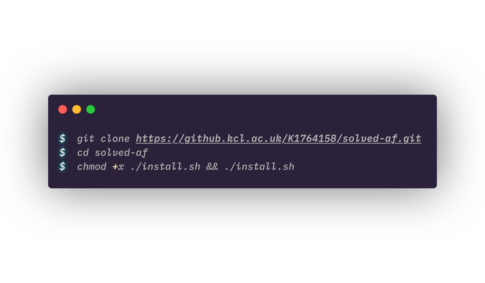
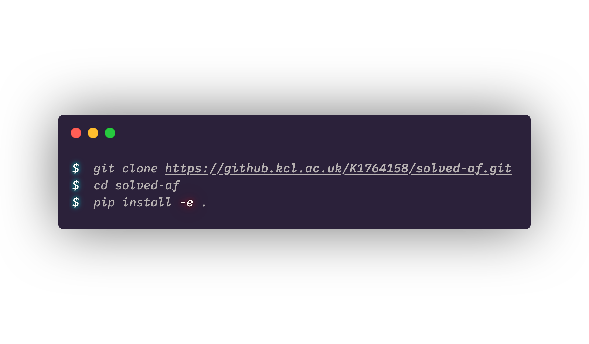
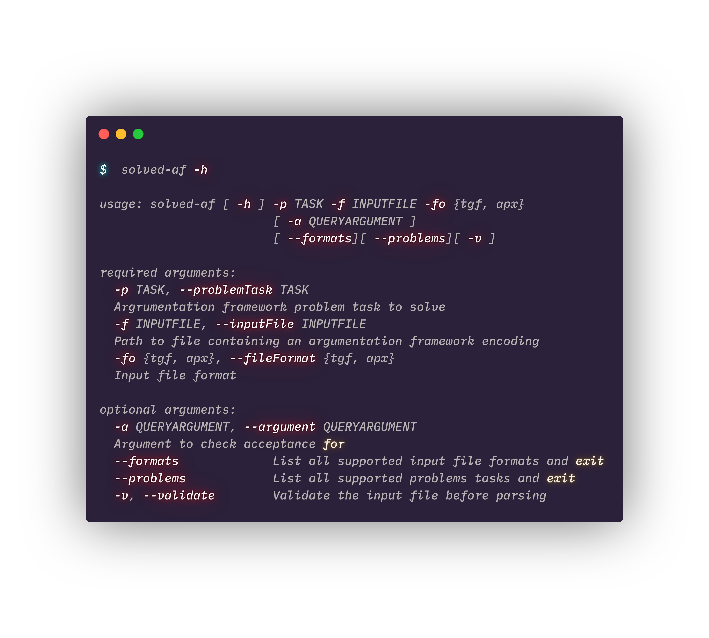
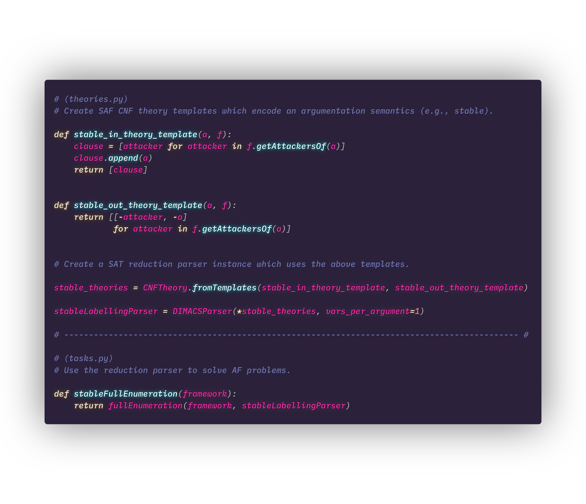

# `Solved-AF` — Solved Argumentation Framework

## an abstract argumentation framework solver to learn from.

<p align="center">
  
</p>
<!-- -->

This repository contains the implementation of an argumentation framework solver to be submitted as part of the final year project (Bachelor Thesis) of David Simon Tetruashvili @ King's College London.

## Installation

### Via `install.sh` script

Use the included `install.sh` script to install `solved-af`.

<p align="center">
  
</p>

```bash
$ git clone https://github.kcl.ac.uk/K1764158/solved-af.git
$ cd solved-af
$ chmod +x ./install.sh && ./install.sh
```

### Via pip

Use the package manager [pip](https://pip.pypa.io/en/stable/) to install `solved-af`.

<p align="center">
  
</p>

```bash
$ git clone https://github.kcl.ac.uk/K1764158/solved-af.git
$ cd solved-af
$ pip install -e .
```

## Usage

`solved-af` follows the established ICCMA solver interface closely with the added option of switching input validation via the `-v` flag.

<p align="center">
  
</p>

## Extendability

In contrast to other available AF solvers, `solved-af` is meant to be flexible, easy to understand and extend (albeit at the cost of performance). For example, here is how to use a reduction parser (`TheoryParser`) to reduce stable semantics to SAT and subsequently solve the full enumeration (`EE-ST`) task under it.

<p align="center">
  
</p>

## Licence

[GNU GPL v3](https://choosealicense.com/licenses/gpl-3.0/)
